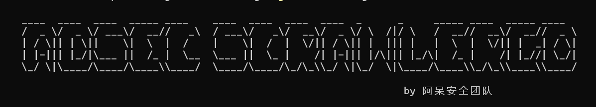

# ADSECCrawlergo - SRC推进器
**郑重声明：文中所涉及的技术、思路和工具仅供以安全为目的的学习交流使用，<u>任何人不得将其用于非法用途以及盈利等目的，否则后果自行承担</u>** 。

一个下一代基于浏览器内核的URL爬行器（crawlergo+katana)

<p align="center"><a href="https://opensource.org/licenses/MIT"></a><a href="https://github.com/z-bool/ADSECCrawlergo"></a></p>

<p align="center"><a href="#install">依赖安装</a> · <a href="#tall">使用说明</a> · <a href="#notice">注意事项</a> · <a href="#communicate">技术交流</a></p>

<div id="install"></div>
<h3>依赖安装</h3>

```bash
go mod tidy # 开启go的mod模式
```

<div id= "tall"></div>
<h3>使用说明</h3>

安全漏洞赏金计划（SRC）离不开对页面的URL进行爬取，这是因为通过获取页面的URL，可以发现更多的资产和潜在漏洞。URL爬取提供了以下必要性：

- 资产发现：通过爬取页面的URL，可以识别出网站中存在的各种资源，如子域名、目录结构、文件路径等。这样的资产发现可以帮助安全研究人员更好地了解目标系统的架构和组成部分。

- 漏洞探测：通过分析和扫描爬取到的URL，可以检测出潜在的漏洞和安全弱点。例如，可以探测到未经授权的访问、敏感信息泄露、SQL注入、跨站脚本攻击等漏洞类型，从而提供给相关方修复漏洞的机会。

- 全面评估：URL爬取能够帮助安全研究人员对目标系统的整体安全状况进行全面评估。通过收集大量URL，可以形成一个全面的攻击面，有助于识别可能被攻击的目标，并制定相应的安全策略和防护措施。

<strong>综上</strong>：通过对页面的URL进行爬取，可以发现更多的资产和潜在漏洞，为挖SRC活动提供必要的信息和基础。所以，这里整合了常用的crawlergo和katana的Headless模式，使其对整个网页的关键位置与DOM渲染阶段进行HOOK，自动进行表单填充并提交，配合智能的JS事件触发，尽可能的收集网站暴露出的入口。内置URL去重，会将结果在终端结尾显示并保存于运行目录下result.txt文件中，考虑多种使用习惯，让漏洞挖掘更高效。

```bash
go run .\main.go -c C:/Users/admin/AppData/Roaming/rod/browser/chromium-1131003/chrome.exe -d https://www.sf-express.com # 以顺丰官网为例，本菜狗在顺丰SRC里混
# 或者使用打包后的二进制文件 -c path -d url即可
# go build .
# ./adsec-scrawlergo -c path -d url
```

`-c` 指定浏览器内核路径，`-d` 指定域名。


这样即为启动，等待爬取完毕。


这样在result.txt看也可以在终端看也可以。

<div id="notice"></div>

<h3>注意事项</h3>

域名不能为空，驱动不能为空。

<div id="communicate"></div>

<h3>技术交流</h3>

